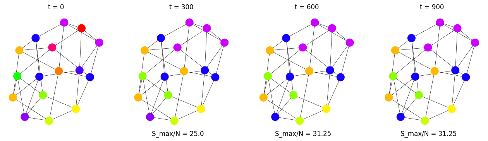

# Modelo de Axelrod
En general supondremos una red cuadrada de largo $L$ , por ende $N=L^2$ nodos. Sin embargo, el modelo fue implementado sobre grafos, guiandonos por la libreria [NetworkX](https://networkx.org/documentation/stable/index.html), podemos decir entonces que una red cuadrada (triangular) es equivalente a un grafo regular de grado 4 (3). 

La definición del algoritmo y su implementación para las dsititntas topologias de redes y parámetros se puede encontrar en [Notebook Colab](https://colab.research.google.com/drive/1Rg4LpwvNVD4K7EktB4BHt4mPsKNZG9fS?usp=sharing). En la primera sección ***DEFINITIONS***  definimos la inicialización [***INIT***] de redes (regulares, completas y scale free) junto con un mapeo de colores para cada estado posible $Q^F$ y luego los pasos [***STEP***,***STEPUB***] tanto para interacciónes sin y con publicidad activa. 
> Nota: La cercanía en el mapeo de colores no siempre significa siempre la cercania entre vectores, en el sentido de carateristicas parecidas.

Mostramos a continuación los resultados obtenidos (en el mismo orden que la notebook)

## Red Cuadrada de largo $L=4$
Empezamos con $N=L^2=16$ nodos en un grafo regular de grado 4 , es decir 4 vecinos por nodo.  Y comparmos distintos valores de $F$ y $Q$ a $t=900$ pasos.

---
Elegimos primero $F=Q=3$

  

---
Luego $F=2,Q=5$

  

---
Seguimos con $F=5,Q=3$

  

---
Y por ultimo  $F=5,Q=5$

  

---
Podemos observar como los únicos casos que lograron converger son los $Q=3$. Entre estos dos llego mas rápido ($200$ pasos antes) el caso $F=5$.  De la misma manera entre los que no lograron converger $Q=5$, el caso con mayor cantidad de freatures $F=5$ alcanzo un % $56.25$ mientras que para $F=2$ consiguió un % $31.25$ de población mayoritaria. Es decir, de acuerdo a la teoría, mayores valores de $Q$ obstaculizan el arribo al macroestado monocultural, mientras que mayores valores de $F$ lo facilitan. 

## $F=10$
Fijamos ahora $F=10$, y variamos $L,Q$ y la topología de la red en grafos regulares de grado 4, 3 y grafos completos.

---
Primero para $L=4,Q=2$ comparamos sobre $t=600$ pasos.  Para este caso la red triangular y la cuadrada convergen a una velocidad similiar, claramente llega a un estado monocultural $200$ pasos antes.

  

  

  

---
A continuación aumentamos el tamaño del sitema y las posibilidades  $L=6,Q=4$ y comparamos sobre $t=12000$ pasos. Ahora si se nota una diferencia entre la red cuadrada, que logra converger, y la red triangular que apenas llega al % $55.55$ de poblacón mayoritaria. Sigue siendo notable la rapidez la red completa, con un gran salto entre el tiempo $t=4000$ con % $5.55$ al tiempo $t=8000$ con la totalidad. 

  

  

  

---
Manteniendo las posibilidades $Q=4$ con un mayor tamaño $L=8$ y comparamos sobre $t=30000$ pasos. Nuevamente se ve la diferencia entre la red triangular y la cuadrada, aunque en este caso particular, la convergencia de la red cuadrada es parecida a la del grafo completo.

  

  

  

---
Seguimos con $L=10,Q=5$ sobre $90000$ pasos. En este caso los tres modelos convergen al final, con diferencias en la proporcion de salto desde el antepenultimo estado reportado, digamos: $100/18=5.55$ para la red cuadrada, $100/50=2$ para la triangular y $100/16=6.25$ para la completa. 

  

  

  

---
Y por ultimo aumentamos masivamente el tamaño $L=18$ con la misma cantidad de opciones anterior $Q=5$ comparando también a $90000$ pasos. En este ejémplo ve nuevamente una mucho mayor rapidez en convergencia de la red cuadra. Como siempre gana la completa y con aun mayor proporción de salto al final $3.21$ en la caudrada vs $6.66$ en la completa.

  

  

  

> No probamos para $Q\geq 6$, pues el mapeo de colores consume mas recursos de los disponibles.

## $Q$ vs $S_{max}$ en un Red Cuadrda
Comparamos ahora la proporicion de la población mayoritaria $100\cdot (S_{max}/N)$ según la cantidad de posibilidades $Q$, en grafos regulares de grado 4 para distintos valores de $L$ y $F$.

---
Primero para $F=2$ y tamaños $L=4$ (azul) y $L=10$ (naranja), variamos para los naturales $Q\in[1,15]$ y sobre cada uno de estos valores tomamos el promedio de $30$ evoluciones de $10000$ pasos.

  
  

Al ser $F=2$ chico, con el crecimiento de $Q$ rapidamente resulta en un decrecimiento del tamño mayoritario alcanzado, sin importar el tamaño $L$, aunque de manera mas pronunciada para el sistema más grande.

---
Luego para $F=10$ y tamaño $L=4$ (azul) variamos para los naturales $Q\in[1,60]$ y sobre cada uno de estos valores tomamos el promedio de $40$ evoluciones de $20000$ pasos. Por otro lado para tamaño $L=10$ (naranja) variamos para los naturales $Q\in[1,15]$ y sobre cada uno de estos valores tomamos el promedio de $30$ evoluciones de $20000$ pasos

  
  

Para el tamaño mas pequeño $L=4$ empezamos a recuperar una curva similar a la obtenida por Castellano *et al*. Se mantienen estados de convergnecia en el comienzo, aunque la caida siguiente parece mas pronunciada.  Para $L=10$ la cantidad de pasos elegida resulta deficiente, por ende, el decrecimiento ocurre de manera tan abrupta pasado $Q=1$, con más tiempo de procesmiento quizas podriamos conseguir la curva de referencia.

## Grafos Scale Free con y sin 'publicidad'
Para finalizar analizamos el modelo el grafos scale free, generados con el algoritmo [scale_free_graph](https://networkx.org/documentation/stable/reference/generated/networkx.generators.directed.scale_free_graph.html) y los parámetros de generación *alpha*,*beta* y *gamma* por default. Comparamos también con la variante donde a cada paso de interacción cultural, hay un agente 'externo' de publicidad que también interfiere en la red.

---
Elegimos primero $L=4,F=2,Q=2$

  

  

Es notoria la gran diferencia en la rpapidez de (máxima) convergencia. En el primer caso tarda $1500$ paso para llegar al % $81.25$ de población mayoritaria, mientras que el modelo con publicidad tarda $50$ pasos en llegar al % $75$. Cabe destacar que en el primer caso los estados en el ultimo paso son el $(0,0)$ con 13 nodos, el $(1,0)$ con 2 nodos y el $(0,1)$ con 1 nodo, por lo tanto todavía hay posibillidad de interacción. Pero en el segundo caso la población mayoritaria nunca podra crecer, justamente el estado de la publicidad $(1,1)$, pues los nodos restantes tienen estado $(0,0)$ y al no compartir ningun atributo, no podran interactuar con ningun vecino distinto (en caso que haya) ni la publicidad los afectara. Podríamos de decir que el sistema en general llego a una ***diferencia irreconciliable***.

---
Ahora para $L=10,F=8,Q=2$

  

  

Con el aumento del tamaño y las freaatures $F$ llegar a la diferencia irreconciliable es menos factible. Por eso es que el primer caso converge  en $1.500.000$ pasos mientras que el segundo converge en $1200$ pasos a la publicidad. Un proporción de diferencia de $1250$!!! 

---
Por último graficamos $Q$ vs $100(S_{max}/N)$ en el tamaño 	$L=4$ con $F=10$.  Variamos para los naturales $Q\in[1,100]$ con promedio de $30$ evoluciónes por caso. En el primer caso elegimos evoluciónes de $1000$ pasos y para el segundo de $10000$ pasos, mostando en verde los valores de la red sin publividad y en rojo los de la red con publicidad activa

  
  

En el primer gráfico se nota bien la diferencia en la rapidez de convergencia que se vieron en los ejemplos particulares anteriores. Con el aumento de pasos, la brecha se acorta, aunque la performance del modelo con publicidad no mejoro tanto en proporción al primero.
