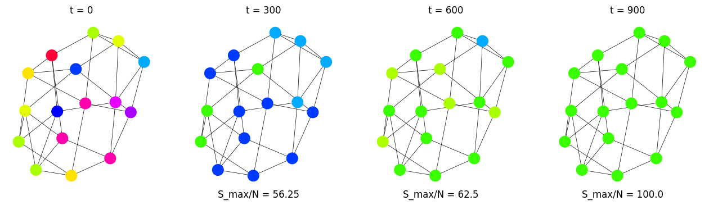

# Modelo de Axelrod
En general supondremos una red cuadrada de largo $L$ , por ende $N=L^2$ nodos. Sin embargo, el modelo fue implementado sobre grafos, guiandonos por la libreria [NetworkX](https://networkx.org/documentation/stable/index.html), podemos decir entonces que una red cuadrada (triangular) es equivalente a un grafo regular de grado 4 (3). 

La definición del algoritmo y su implementación para las dsititntas topologias de redes y parámetros se puede encontrar en [Notebook Colab](https://colab.research.google.com/drive/1Rg4LpwvNVD4K7EktB4BHt4mPsKNZG9fS?usp=sharing). En la primera sección ***DEFINITIONS***  definimos la inicialización [***INIT***] de redes (regulares, completas y scale free) junto con un mapeo de colores para cada estado posible $Q^F$ y luego los pasos [***STEP***,***STEPUB***] tanto para interacciónes sin y con publicidad activa. 
> Nota: La cercanía en el mapeo de colores no siempre significa siempre la cercania entre vectores, en el sentido de carateristicas parecidas.

Mostramos a continuación los resultados obtenidos (en el mismo orden que la notebook)

## Red Cuadrada de largo $L=4$
Empezamos con $N=L^2=16$ nodos en un grafo regular de grado 4 , es decir 4 vecinos por nodo. 

Elegimos primero $F=Q=3$

  

Luego $F=2,Q=5$

  

Seguimos con $F=5,Q=3$

  

Y por ultimo  $F=5,Q=5$

  

## Red Cuadrada, Triangular y Grafo Completo sobre $F=10$
Fijamos ahora $F=10$, y variamos $L,Q$ y la topología de la red en grafos regulares de grado 4, 3 y grafos completos.

Primero para $L=4,Q=2$

  

  

  

---

  

  

  

---

  

  

  

---

  

  

  

---

  

  

  

## $Q$ vs $S_{max}$

  
  

  
  

## Grafos Scale Free con y sin 'publicidad'

  

  

  

  

  
  

