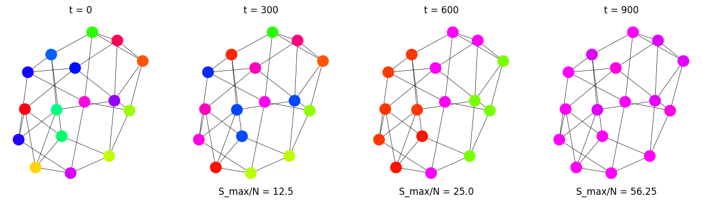

# Modelo de Axelrod

[Notebook Colab](https://colab.research.google.com/drive/1Rg4LpwvNVD4K7EktB4BHt4mPsKNZG9fS?usp=sharing)

## Red Cuadrada de larlgo $L=4$

  

  

  

  

## Red Cuadrada, Triangular y Grafo Completo sobre $F=10$

  

  

  

---

  

  

  

---

  

  

  

---

  

  

  

---

  

  

  

## $Q$ vs $S_{max}$

  
  

  
  

## Grafos Scale Free con y sin 'publicidad'

  

  

  

  

  
  

